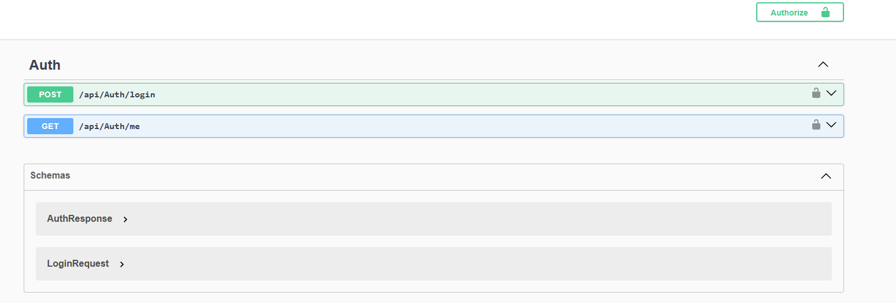
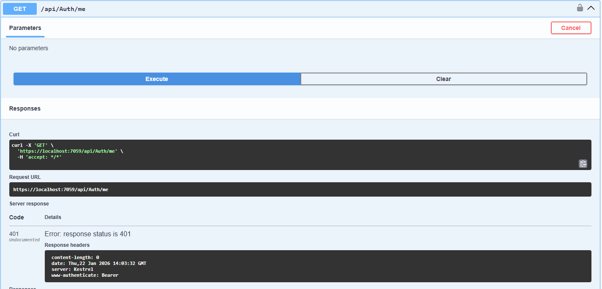
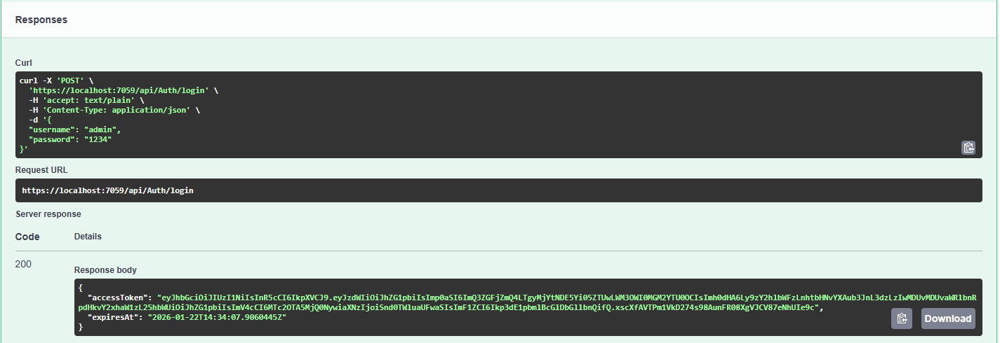

# 🔐 JWT Authentication Mini Project (.NET 8)

A minimal ASP.NET Core Web API project demonstrating JWT (JSON Web Token) authentication from scratch.

This project is intentionally kept small to clearly explain:

how JWTs are created

how they are validated

how [Authorize] works in ASP.NET Core

# ✨ Features

- JWT token generation on login

- Protected endpoint using [Authorize]

- Swagger UI with Bearer Token support

- Clean separation of concerns (Controller / Service / Models)

- No database (hardcoded demo user for learning purposes)

🧱 Tech Stack

- .NET 8

- ASP.NET Core Web API

- JWT Bearer Authentication

- Swagger (OpenAPI)

# 🔑 Demo Credentials
- Username: admin 
- Password: 1234

# 🚀 How It Works
## 1️⃣ Login and get JWT

### Endpoint

POST /api/auth/login


Request Body
```bash 
{
  "username": "admin",
  "password": "1234"
}
```

---
Response
```bash
{
  "accessToken": "eyJhbGciOiJIUzI1NiIsInR5cCI6...",
  "expiresAt": "2026-01-22T15:30:00Z"
}
 ```

## 2️⃣ Use JWT to access protected endpoint

Endpoint
```bash
GET /api/auth/me
```

Header

Authorization: Bearer {your_jwt_token}


If the token is valid, the API returns user info and claims.

# 🧠 JWT Flow Explained

- User logs in with credentials

- Server creates a JWT using:

- Issuer

- Audience

- Secret Key

- Expiration time

- Client stores the token

- Client sends the token in Authorization: Bearer header

- ASP.NET Core validates:

- Signature

- Expiration

-  Issuer & Audience

- [Authorize] allows or blocks access

# ⚙️ JWT Configuration

JWT settings are defined in appsettings.json:

```bash

"Jwt": {
  "Key": "SUPER_SECRET_KEY_CHANGE_THIS",
  "Issuer": "JwtMiniApi",
  "Audience": "JwtMiniApiClient",
  "ExpiresMinutes": 30
}
```

### ⚠️ Do not commit real secrets in production. Use environment variables or secret managers instead.


# 🎯 Purpose of This Project

This project was built for learning purposes to deeply understand:

- JWT fundamentals

- ASP.NET Core authentication pipeline

It can be extended with:

- ASP.NET Core Identity

- Refresh Tokens

- Role-based authorization

- Database integration

## 🖼️ Screenshots 






